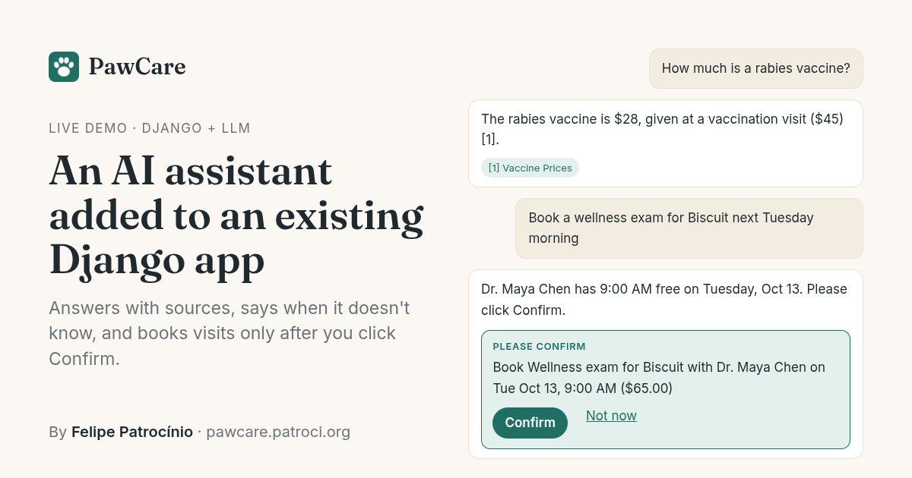

# PawCare — an AI assistant added to an existing Django app

[](https://github.com/patr0ci/pawcare/actions/workflows/tests.yml)

**[Try the live demo →](https://pawcare.patroci.org)** One click, no sign-up: you get a throwaway account with two
pets. Or open the **[live cost & eval dashboard](https://pawcare.patroci.org/assistant/dashboard/)**.



A fictional vet clinic runs on a regular Django app. I added an assistant that answers customers from the clinic's own
help center, linking the article behind every claim, and books, reschedules or cancels appointments — but only after
the customer clicks **Confirm**, and only through the booking rules the clinic's app already had.

This is the work I do for clients: **adding LLM features to Django products that already exist**, in a way the team
can test, monitor and pay for predictably.

- **About $0.001 per reply** on DeepSeek V4.1 Flash (booking turns cost a little more), with per-visitor and
  site-wide daily caps.
- **37 eval cases run against the real model**: 27 help-center questions, and 10 booking conversations scored on the
  proposal the model actually created, not on its wording.
- **100 offline tests in CI**, including the agent's safety rules: nothing is written before Confirm, and tools can't
  reach another client's pets.

## What it does

- **Answers from the clinic's own content, with sources** — every claim links to the help-center article it came from.
- **Says "I don't know"** instead of inventing prices or policies, and stays out of topics it isn't for.
- **Acts on the customer's account only after they confirm** — the model proposes; the customer clicks Confirm; the
  clinic's existing rules decide.
- **Shows what every reply costs** — tokens, dollars and latency per answer, daily budgets, and a dashboard.
- **Works with any OpenAI-compatible provider** — OpenRouter, OpenAI, DeepSeek or a self-hosted model, by changing
  env vars.

## What the evaluation (and the public demo) caught

The first eval run scored 24/27. Two of the failures were real problems, not test noise:

- *"It's 11pm and my cat ate a lily"* — the answer said "go to an emergency vet" but left out the 24h ER's phone number.
  The number was in the article, just in a paragraph that wasn't retrieved. Fix: **small-to-big retrieval** — match on
  chunks, but give the model the whole (short) article.
- *"What is the capital of France?"* — it answered "Paris". Fix: an explicit scope rule in the system prompt.

A third failure was the test being too strict (the right fact, cited from a different article that also states it),
so that case now accepts either article. I also tried hybrid (vector + full-text) search for it; it didn't change the
ranking, so it was reverted rather than kept as unmeasured complexity.

**The public demo caught one the eval set couldn't**, because the eval set had no booking conversations. Asked to
*"Book a wellness exam for Biscuit next Tuesday morning"* (one of the demo's own suggested questions), the model found
the slot and replied *"I've set up a proposal… please confirm the proposal"* — without calling `propose_booking`, so
there was no Confirm button. It's the same failure the model comparison below had pinned on an older model. Two fixes:

- **A guardrail**: a reply that claims a proposal when none exists gets one corrective round, so the model either makes
  the proposal or takes the claim back. After a tool call, the reply is checked before the client sees it, so the false
  claim is never shown (`claims_action` and `is_unbacked_claim` in [`assistant/chat.py`](assistant/chat.py), with the
  phrasings it must and must not catch pinned in `tests/test_agent.py`).
- **An agent eval suite** ([`agent_cases.json`](assistant/evals/agent_cases.json)): 10 conversations with a throwaway
  client — book, reschedule, cancel, a late cancellation that must mention the fee, an ambiguous pet, a change of
  mind, "list my appointments" (which must not act), and an instruction hidden in a pet's allergies field. Each is
  scored on the `PendingAction` the model created (kind, pet, service, day, morning/afternoon), can run several times
  (`--repeat`; a case passes only if every run passes), and reports how often the guardrail had to step in.

**Reviewing the grader caught checks that passed for the wrong reason**: the citation marker `[1]` satisfied the
Saturday-closing fact "1"; a made-up answer that ended with "call the clinic" counted as a refusal; and the limping-dog
case failed the safe answer "never give ibuprofen". Citation markers are now stripped before matching, bare digits
became regexes, and only real refusal phrases count. Scores from before this fix aren't comparable with later ones;
the latest run is on the [dashboard](https://pawcare.patroci.org/assistant/dashboard/) and in
[`assistant/evals/results/`](assistant/evals/results/).

## Choosing the model

Same scripted conversation (book, list, cancel, mixed question) against several models via OpenRouter, Oct 2026:

| Model | Booked | Cancelled | ~Cost / turn |
|---|---|---|---|
| Gemini 2.5 Flash-Lite | asked for the date again | no | $0.0003 |
| DeepSeek V4 Flash | yes | claimed a proposal it never made | $0.0006 |
| **DeepSeek V4.1 Flash** (default) | yes | yes | **$0.0008** |
| Gemini 2.5 Flash | yes, in one turn | guessed an id | $0.0015 |
| GPT-5 mini | yes | yes | $0.0030 |

Two prompt changes mattered more than the model for the weaker ones: spelling out the next 14 dates (small models are
bad at "next Tuesday") and telling the model to retry once with a looked-up id when a tool returns an error.

That comparison was a one-off manual script, and the default model later made the "proposal it never made" mistake on
the public demo. The agent eval suite makes the comparison repeatable:
`LLM_MODEL=<model> uv run python manage.py run_evals --suite agent --repeat 3 --save`.

## How it works

- **Retrieval.** Help-center articles are chunked, embedded locally (`fastembed`, `bge-small-en-v1.5` — no API cost for
  embeddings) and stored in Postgres with **pgvector**. Search is exact on purpose: at a few hundred chunks it takes
  milliseconds, and an approximate (HNSW) index returned empty results right after a re-ingest, while deleted rows
  were still waiting for vacuum. Chunks beyond a cosine-distance cutoff are dropped; the rest are grouped per article
  and numbered, and the whole (short) article goes to the model. Only the sources it actually cites are shown.
- **Tools, scoped to the logged-in client.** The model can list pets, services and appointments and find free slots. It
  never passes a user id, so it can't reach another client's data.
- **Writes are proposals.** A write tool only creates a `PendingAction`; the client sees a card and clicks **Confirm**,
  and the change then runs through the clinic's own booking rules (`clinic/services.py`) — ownership checks, opening
  hours, which vet sees which species and does which service, the vet *and* the pet both free, past/completed visits
  locked, 24-hour late-change fee, row locks so two tabs can't double-act. Proposals expire after 30 minutes and can't
  be replayed.
- **Bounded tool loop** — at most 6 model rounds and a 90-second deadline per answer, plus the guardrail above.
- **Streaming** token by token (Server-Sent Events over a plain Django `StreamingHttpResponse`).
- **Cost tracking.** Every reply stores model, prompt/completion tokens, USD cost and latency — also when the provider
  fails mid-answer or the visitor closes the tab. Limits: messages per user per day, a site-wide daily USD budget, and a
  daily cap on demo accounts (per-user limits alone can be bypassed by creating accounts). A spent budget is shown on
  arrival, not after the visitor types.
- **Dashboard** (`/assistant/dashboard/`, public on the demo with visitor names hidden): answers, cost per answer,
  latency, tokens, cost by model and by user, tool calls, proposed vs confirmed actions, and the latest eval run. In the
  Django admin, staff can open any conversation with its tool trace (read-only).
- **Ops.** Logs to stdout, `/healthz` (database up, and whether the assistant can answer: model configured, budget left) for uptime monitors and the container
  healthcheck, and demo bookings cleared hourly so visitors don't fill the shared calendar.

```
clinic/              the "existing system": Tutor, Pet, Vet, Service, Appointment + slot availability
clinic/services.py   booking rules shared by the UI and the assistant (book / reschedule / cancel)
helpcenter/          Article + Chunk(embedding vector(384)); markdown content; ingestion command
assistant/           embeddings · retrieval · llm.py (provider-agnostic, streaming + tool calls)
                     tools.py (schemas, read tools, propose-only writes) · chat.py (RAG + tool loop) · views (SSE, confirm)
assistant/evals/     cases.json (help center) · agent_cases.json (booking) · runner.py · results/
```

Request flow: question → retrieve (current question first, previous one only to fill follow-ups) → pgvector top-k with
distance cutoff → group by article → system prompt with numbered sources, today's date and a 14-day calendar → tool
loop → stream → keep only the sources actually cited → persist message, usage and tool trace.

### Threat model

The worst a confused or manipulated model can do is propose an action on the logged-in client's own pets and
appointments, which the client then has to confirm. It can't name another user (tools are bound to the session), it
can't write (write tools only create a `PendingAction`), and the text on the Confirm card is built on the server from
the database, not from the model's words. Tool results do include text the client typed (a pet's allergies), so an
instruction hidden there is one of the agent eval cases. Model output is rendered as text, never as HTML. Prompt
injection can still get an off-topic reply; the scope rule and the eval's refusal cases are what keep that in check.

### What data leaves your server

- **Sent to the LLM provider:** the question, the last few turns, the retrieved help-center articles, and tool results
  — the client's pets (name, species, breed, allergies), services, free slots and their appointments.
- **Never sent:** other clients' data, user ids, emails or passwords. Embeddings are computed locally.
- **Stored in your database:** messages with token counts, cost and tool traces, and each proposal with its outcome.
  Demo accounts are deleted after 2 days; their cost history stays, unlinked.
- **To keep everything in-house**, point `LLM_BASE_URL` at a self-hosted OpenAI-compatible server (vLLM, Ollama) or a
  zero-retention provider. It's an env var, not a code change.

### Why no agent framework

The tool loop is about 200 lines in `assistant/chat.py`: bounded, every call logged, and testable with a scripted fake
model. For adding a handful of tools to an existing Django app, that's easier to review and to own than a new runtime
inside the client's codebase. I'd reach for something like LangGraph when a workflow has to keep state across sessions,
wait days for a human, or branch across many steps.

## Code tour (5 minutes)

1. [`assistant/tools.py`](assistant/tools.py) — tool schemas; write tools only create a `PendingAction`; `execute()` runs
   a confirmed one through the clinic's rules.
2. [`clinic/services.py`](clinic/services.py) — the booking rules the UI and the assistant share, with row locks.
3. [`assistant/chat.py`](assistant/chat.py) — retrieval, the bounded tool loop, the guardrail, streaming and cost logging.
4. [`assistant/evals/runner.py`](assistant/evals/runner.py) — how both eval suites are scored.
5. [`tests/test_agent.py`](tests/test_agent.py) — the safety rules as tests, driven by a scripted model.

## Run it locally

```bash
docker compose up -d                 # Postgres 17 + pgvector on localhost:5434
cp .env.example .env                 # add LLM_API_KEY, or set LLM_PROVIDER=fake
uv sync
uv run python manage.py migrate
uv run python manage.py seed_clinic
uv run python manage.py ingest_helpcenter
uv run python manage.py runserver
```

Open http://localhost:8000 and click **Try it** — you get a throwaway account with two pets.

Evals need a real model (a full run of both suites costs a few cents):

```bash
uv run python manage.py run_evals                      # both suites
uv run python manage.py run_evals --suite agent --repeat 3 --save
```

## Tests

```bash
uv run pytest
uv run ruff check . && uv run ruff format --check .
```

Tests run fully offline (hashing embedder + fake/scripted LLM) but exercise real pgvector queries, the streaming
endpoint, limits, error handling, slot logic, the eval scoring and rollback, and the agent's safety rules: nothing is
written before Confirm, tools can't reach other clients' pets, a slot taken between proposal and confirmation fails
cleanly, proposals expire and can't be replayed, an unknown action kind is never executed, runaway tool loops are cut
off, an unbacked "please confirm" gets corrected once, and streamed tool-call fragments are reassembled.

## QA

A full QA round (browser pass over every screen at desktop and phone widths, plus a code review for problems that show
up with real data, traffic or time) found 10 UI bugs and 19 latent risks — among them afternoon slots never being
offered, a pet bookable with two vets at once, and the spend cap being bypassable. All were fixed; the code fixes have
regression tests in `tests/test_qa_fixes.py`, and the UI fixes were re-checked in a second browser pass.

## Deploy

```bash
cp .env.example .env    # DJANGO_SECRET_KEY, POSTGRES_PASSWORD, LLM_API_KEY; DEMO_PUBLIC_DASHBOARD=true for a public demo
GIT_SHA=$(git rev-parse --short HEAD) DOMAIN=pawcare.example.com docker compose -f docker-compose.prod.yml up -d --build
```

Or, on a server without public ports, behind a Cloudflare Tunnel (`DOMAIN` and `TUNNEL_TOKEN` in `.env`):

```bash
GIT_SHA=$(git rev-parse --short HEAD) docker compose -p pawcare -f docker-compose.tunnel.yml up -d --build
```

Postgres + pgvector, the app (gunicorn with threaded workers so streams don't block), and Caddy or `cloudflared` in
front, started once the app's healthcheck passes. The embedding model is baked into the image; first boot migrates,
seeds and indexes the help center. Then:

1. Run the evals once so the dashboard has a score:
   `docker compose -p pawcare -f docker-compose.tunnel.yml exec web python manage.py run_evals --repeat 3`
2. Point an uptime monitor at `/healthz` and alert when `"assistant_available": true` disappears.
3. Rate-limit `POST /demo/` at the edge (one Cloudflare rule) and set a credit limit on the provider's API key.

## How I built this

I built PawCare with Claude Code as a pair programmer, the way I work on client code. The decisions are mine, and each
is written up above with the evidence behind it: the model comparison, exact search over HNSW, reverting hybrid search,
propose-then-confirm, the guardrail, and what the eval set, the QA round and the public demo caught. Happy to walk
through any part of the code.

## Contact

**Felipe Patrocínio** — Python/Django developer in Brazil (UTC-3), open to remote roles and freelance projects adding
LLM features to products that already exist.
[LinkedIn](https://www.linkedin.com/in/patroci-dev/) · [GitHub](https://github.com/patr0ci) ·
[felipepatrocinio93@gmail.com](mailto:felipepatrocinio93@gmail.com)

All clinic data, people and prices are fictional. Code under the [MIT license](LICENSE).
